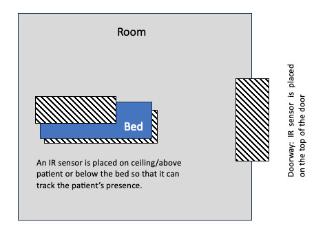
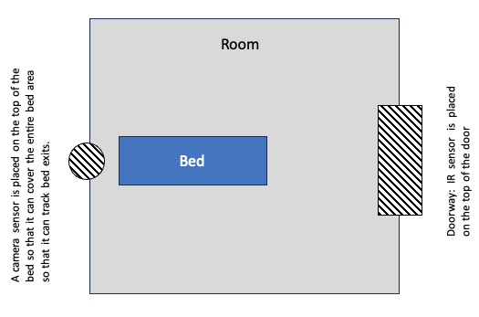

## Task Understanding: Key Takeaways, Possible architectures - Sensors Module

### 1. Developing a tracking system
* To monitor persons entering and exiting a room (Tracking patient mainly).
+ Able to identify the motion of patient (gets out of a bed/chair - stable to motion state).
+ Able to send signal based on allowed movements for particular patient Id.

  `Given Scenarios:`
  + Scenario 1: Patients can get out of bed but not leave the room.
  - Scenario 2: Patients may not be allowed to get out of bed.  
  
  `Additional Scenarios:`
  * Scenario 3: Checking whether patient fell on the floor (Scenario where patient has fainted suddenly, add on for Scenario 1).

- Components: Raspberry Pi, Grid-eye 

### 2. Research: Analysing various implemented solutions**

`Paper 1: Perra et al., 2021`
#### Aim:
Develop a device to monitor the number of people in indoor settings using a low-cost infrared (IR) array sensor mounted atop doorways. The primary goal is to verify the effectiveness of the pattern recognition algorithm designed for this purpose.

#### Sensor Implementations:

##### Other Sensors:

* PIR sensor mesh network combined with improved Kalman filter and particle filter for human tracking.
* PIR system leveraging Expectation-Maximization-Bayesian tracking to identify people via body heat radiation.
* Prototype ultrasonic sensor array for indoor human detection.

##### IR Sensor Implementations:
* Estimate human motion direction with 80% accuracy using a 64-pixel IR sensor array combined with a support vector machine.
* Use of Otsu’s binarization for estimating people flow through doorways with 93% accuracy using a low-res IR sensor.
* Noise removal technique using the Kalman filter for human detection with 8 × 8 pixel thermal sensor arrays.
* Probabilistic method for human detection using heat signatures from a low-resolution thermal IR system.
* Doorway occupancy counter using an IR array and Kalman filter.
* A combined approach of sensor technology and machine learning (e.g., logistic regression, K-Nearest neighbors) for indoor human localization.

#### Implementation Details in this paper:

* The core is a real-time pattern recognition algorithm processing data from an infrared (IR) array sensor.
* Communication via a Z-wave network (Mesh topology with limited range).
* Utilizes a thermal array (64 thermopile elements in an 8 × 8 grid) to count individuals in a room through pattern recognition.
* Important components/topics in this paper are IR sensor, Z-wave network (for sending information), pattern recognition algorithm.

#### Relevance to WatchDog Project:

* Monitoring of people entering and exiting real-time.
* Algorithm analyzes IR sensor time-series data to identify human transit events across doorways.
* Capability to discern various human walking speeds and distances from the sensor (1.5m, 5m, 7.5m).

#### Evaluation:
* Field tests were conducted in office and lab settings by installing the device on doorways.
* To gauge the algorithm's accuracy, synthetic data was produced, factoring in standard residential temperature ranges, varying walking speeds, and different sensor-person distances.
* Research also reviewed different computational methods used with similar (8 × 8 pixel) thermal array IR sensors for human movement detection.

### 3. Proposed Architectures

* I have developed 2 architectures, it is based on 1-Camera and 1-IR sensor and 2-IR sensors.

#### Architecture 1:
* It utilizes two infrared (IR) sensors to monitor patient presence in a hospital room without the use of a camera.

* The first IR sensor is positioned near the doorway to count the number of people entering and exiting the room. When the counter reaches 0, it indicates that the patient may have left the room, triggering an alert.

* The second IR sensor is placed either below the bed or on the ceiling above the patient. This IR sensor serves a dual purpose:

  * It continuously detects the presence of the patient on the bed.
  * It tracks the patient's movements within a maximum range of 7.5 meters.

    

The system is designed to ensure patient safety and prevent any unauthorized exits. By using these two IR sensors strategically, Architecture 0 can monitor the patient's presence and movements in the room effectively.

#### Architecture 2:
* It utilizes infrared (IR) sensors on the doorway to monitor the count of people entering or exiting a room. The system covers the following scenarios:

* The counter is initially set to 1 when a patient enters the room. It continuously tracks the number of people entering and exiting. If the counter reaches 0, it indicates a high chance that the patient has left the room.

* To overcome a drawback of relying solely on IR, where the patient might leave the room while the doctor remains inside, a camera is integrated into the system. The camera constantly tracks and identifies the patient's face or monitors any patient movement in or out of the bed. Therefore, if the camera fails to detect the patient's face on the bed or in the room and the IR detects someone leaving the room recently, the alarm will still trigger.

* For counting/tracking in and out counts, I will be using pattern recognition algorithm, used in Perra et al., 2021.
* For detecting BED exit actions, several methodologies are under consideration: the Faster Region CNN (Bewley et al., 2016), the Kalman filter paired with the Hungarian algorithm, or potentially using CNN (Chen et al., 2017) or LSTM (Inoue & Taguchi, 2020).

    

In summary, to avoid false alarms, the system requires two conditions to be met simultaneously: the camera must successfully identify the patient's face, and the IR sensor must have a room occupancy count of at least 1. Only when both conditions are satisfied, the alarm will not trigger.
