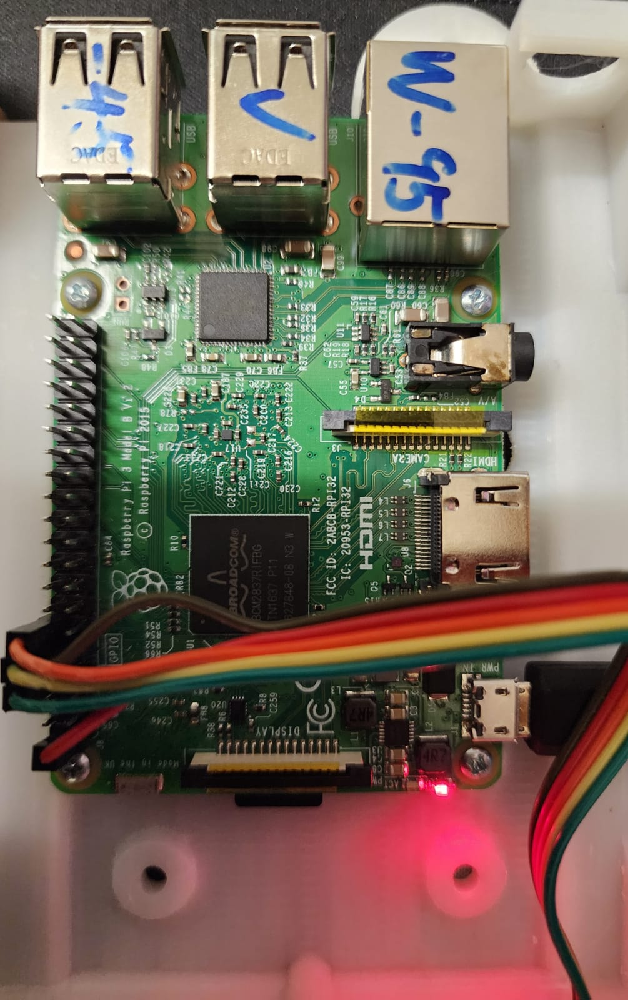
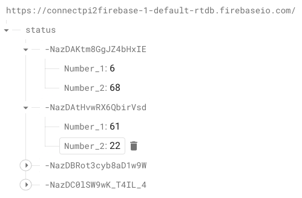
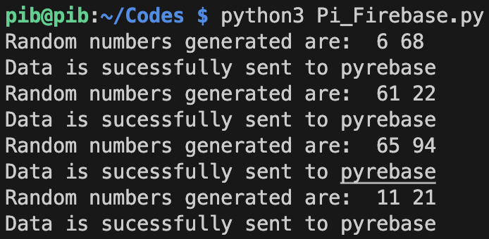
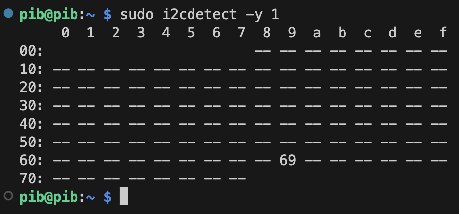
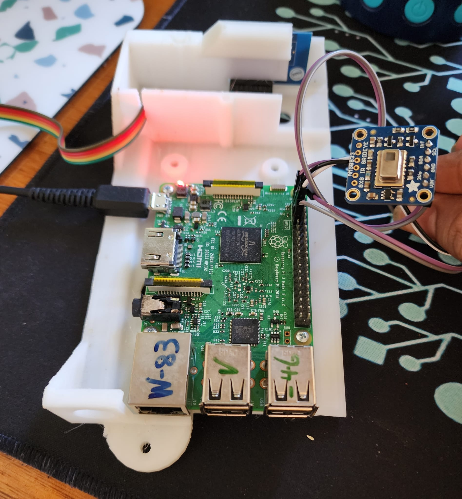
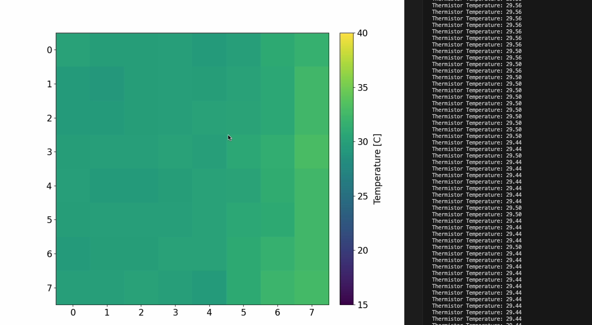
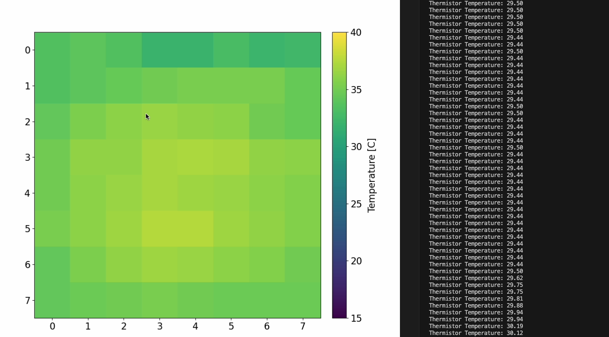
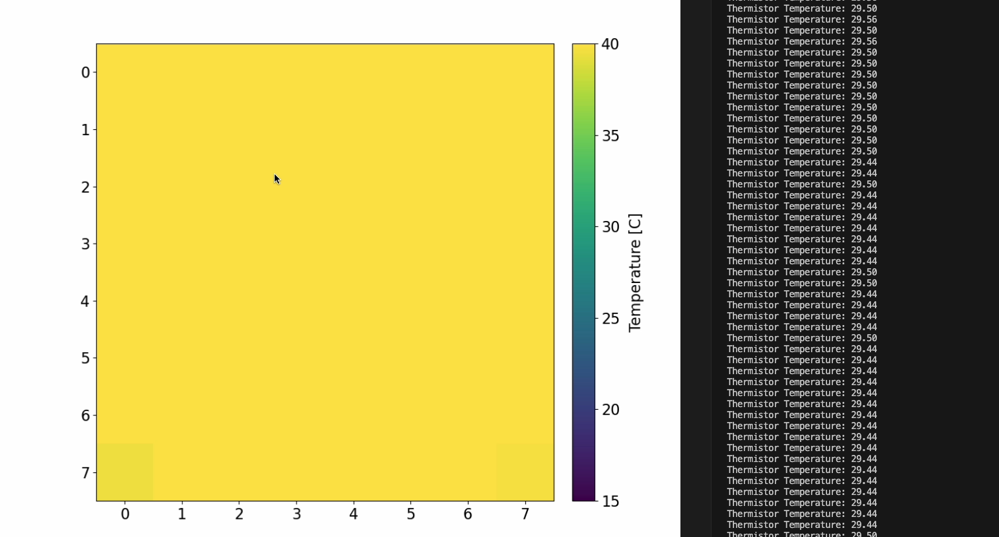
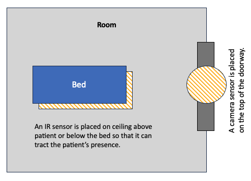

# Research Insights: Analysing various implemented solutions

### `Paper 1: Perra et al., 2021 - IR & Pattern Recognition Algorithm`
*Perra, C.; Kumar, A.; Losito, M.; Pirino, P.; Moradpour, M.; Gatto, G. Monitoring Indoor People Presence in Buildings Using Low-Cost Infrared Sensor Array in Doorways. Sensors 2021, 21, 4062. https://doi.org/10.3390/s21124062*

### Pattern Recognition Algorithm:

- **Sensor Dynamics:** The sensor produces frames equivalent to 8 × 8-pixel images at a frame rate varying between 1 and 10 fps.
- **Data Processing:** The algorithm analyses the latest four frames in a sliding FIFO buffer fetched from the infrared sensor. Each frame is then stored in this FIFO buffer and removed once processed.
- **Event Detection Mechanism:** The frames are divided into bins and analysed sequentially to determine the direction of human movement (4 -> 2*8 bins).
- **Algorithm Reset:** An empirically chosen timeout of N frames (n = 40) from the last detected event is set for a periodic algorithm reset.
- **Installation and Setup:** The IR sensor is strategically positioned at the upper access wall of the monitored environment. During testing, users executed specific, predefined actions in a particular sequence (I, O, IHO, OHI, IHI, OHO).

### Experimentation and Validation:

- **Testing Phases:** The IR sensor setup validation was conducted in three stages:
  1. **First Phase:** Gathering thermal images to obtain offline calibration metrics for the pattern recognition algorithm. For this they used the data that they collected initally to identify patterns (I, O, IHO, OHI, IHI, OHO -> this data).
  2. **Second Phase:** Functionality verification of the algorithm, both in real-time and offline. This included analysis with Matlab (2018) and C++ programming. Synthetic frame sequences have been generated for simulating temperature ranges typical of a residential environment, different human walking speed (normal, brisk, running), and different distances between the person and the sensor (1.5 m, 5 m, and 7.5 m). Two categories of tests were performed: (i) using a step and (ii) using a ramp.
      - **Step Test:** Aimed at validating the algorithm's response to set inputs under varying environmental conditions. It verified the algorithm’s response to the predetermined inputs set at different levels of ambient conditions and the perturbation of temperature with the initial collected data.
      - **Ramp Test:** This utilized a similar dataset as the step test but varied the number of frames representing human speeds  (with 44, 31, and 21 frames representing normal, brisk, and running human speeds).
  3. **Third Phase:** Simulating realistic human movement and evaluating the algorithm's performance in standard conditions.

### Evaluation:

- **On-Field Testing:** The device was evaluated by placing it on top of doorways in offices and laboratory rooms.
- **Accuracy Testing:** For ensuring the algorithm's accuracy, synthetic data mimicking various walking speeds, temperature ranges, and sensor-person distances was generated.
- **Comparative Research:** Research has been carried out to compare our approach with other studies that have used similar thermal array IR sensors, but with different computational methodologies.

### Conclusion:
In this paper, they presented a approach that detects human presence in an indoor environment by combining thermal imaging provided by the IR sensor array with pattern recognition algorithm.

### Essential Insights for WatchDog:
- **Monitoring People Movement:** The project can be used for tracking the number of people entering and exiting a monitored environment (home/hospital use).
- **Algorithm Capabilities:** Project used a pattern recognition algorithm to analyse the IR sensor time-series data. This is essential for identifying events like individuals crossing a doorway in watchdog project.
- **Human Movement Analysis:** The system can detect varied human walking speeds like normal, brisk, and running. It also recognizes different distances between a person and the sensor, including 1.5 m, 5 m, and 7.5 m at different ambient temperatures.

---
### `Paper 2: Inoue & Taguchi, 2020 - Bed Exit Action with LSTM`
*M. Inoue and R. Taguchi, "Bed Exit Action Detection Based on Patient Posture with Long ShortTerm Memory," 2020 42nd Annual International Conference of the IEEE Engineering in Medicine & Biology Society (EMBC), 2020, pp. 4390-4393, doi: 10.1109/EMBC44109.2020.9175619.*

### AIM: 
- **Goal**: Prevent patient falls in hospitals using image processing technology.
- **Problem with Previous Research**: High accuracy in detecting patient's end sitting position but struggles with patients eating or responding to visitors.
- **Proposed Solution**:
  - Detect patient's bed exit action by analyzing patient posture using images from a monocular camera processed by Long Short-Term Memory (LSTM).
  - Achieved 99.2% detection rate with a 5.7% false detection rate.
  - Prioritizes patient privacy by only handling posture information abstracted from images.

### Background Research:
- Used Microsoft's Kinect to detect bed position and monitor patient’s condition.
- Banerjee et al.2014: Estimation of the bed's height difference relative to the floor and determined patient's fall by assessing the absence of a person's seat based on the shape of the bed's surface. and many other literature reviews are made by author.

### Proposed Method:
- **Strategies**: 
  - Abstraction of input information.
  - Use of relative position information for time-series human images.
- **Techniques**:
  - Detect patient posture and bed position from the image.
  - Analyze coordinate information with LSTM to detect Bed Exit Action (BEA).
  - Abstraction of human information using posture estimation method of Cao et al., 2017.
  - Focus on three-point coordinates: neck, right hip, and left hip.
  - Use center of bed gravity coordinates to distinguish different movements.
  - Convert coordinate information into relative values.
  - Calculate relative coordinates based on the center of gravity from bed coordinates.
  - Identify patient for judging the BEA based on minimum distance from the center of gravity of the bed (Other than patient in bed area).
  - Classify output into two categories: BEA and Other Actions (OA). Used cross entropy error for learning.

### LSTM Architecture/model used:
- Used posture estimation model from Cao et al.'s paper.
- Node configuration: 
  - Input layer: 6 nodes; Hidden layer: 20 nodes; Output layer: 2 nodes.
  - Input data steps: 50; Missing data represented as -1 (If Posture estimation failed) for less than 50 frames.
  - Learning iterations: 30,000; Batch size: 32; Dropout ratio: 0.25.
  - Optimization method: Stochastic Gradient Descent (SGD); Learning rate: 0.003.
  - **These values are important if I need to reproduce this architecture.**

### Evaluation:
- Preliminary learning and accuracy evaluation on bed detection:
  - Constructed a BEA detector and evaluated its accuracy.
  - Used 720 × 480 images from cameras at 10 positions.
  - Camera height: 1700mm.
  - Manually input coordinates of bed's four corners as true values.
  - Fixed bed height at three positions (250mm, 400mm, 550mm) - 33.33%:33.33%:33.33% data used.
  - Detected coordinates of patient's limbs and bed using posture estimation.
  - Training samples = 2776 Moving samples of Patient in bed, without patient on bed, empty bed with different positions of pillows/bedsheets.
- Real-Time Evaluation:
    - Used learned model weights on 308 video data samples of patient and bed environment.
    - Evaluated on 27 hours of real-time footage in 2 hospital rooms, observing patient movements, nurse entries and exits, and their room occupancy durations.

### Conclusion:
In this paper, they have designed a model to detect bed exits. Leveraging image processing and LSTM, the model provides an advanced solution to ensure patient safety, data privacy in hospital settings by identifying potential fall risks.

### Essential Insights for WatchDog:
- Bed-exit detection can be especially useful, but they havent showed these results for an individual camera to identify and track multiple people's motion from same frame. 
- But it is useful for tracking "Scenario, where patient is not allowed to exit the bed", there it is useful, because the model has two outcomes BEA and other Actions. Since the model can classify and resolve one of the given scenarios of task, it can be useful.
- Not sure, How hard it can be to reproduce results from this paper, though model architecture is given, because of lack of data/training samples.

---
### `Paper 3: Chen et al., 2017 - Bed Exit Action with CNN`
*T. Chen, R. Hsiao, C. Kao, W. Liao and D. Lin, "Bed-exit prediction based on convolutional neural networks," 2017 International Conference on Applied System Innovation (ICASI), 2017, pp. 188191, doi: 10.1109/ICASI.2017.7988382.*

### AIM:
- Introduce a deep convolutional neural network (CNN) model for in-bed behavior recognition and bed-exit prediction.
- Training was based on two types of images: those taken several intervals before a patient's bed-exit and usual in-bed activity images.
- The goal is to create an alarm system for potential bed exits, enhancing patient safety.

### Literature Review:
- Earlier studies used pressure-sensitive systems like pressure mats and pressure sensitive alarms.
- Pressure mats:
    - Need regular maintenance.
    - Aren't disposable and require frequent disinfection.
    - Might not be sensitive enough for certain patient demographics.
    - Unsuitable for restless patients.
- Pressure-sensitive alarms may not be sufficiently sensitive for: 
    - Patients with low weight, or for use with patients who suffer from dementia, delirium, or other behavioral symptoms such as restlessness, who keep moving.

### Proposed Solution:
- Categorized Bed-exits into:
    1. Patient sits up but stays in bed.
    2. Patient sits up and exits bed immediately (focused on this in this research).
    3. Patient exits bed via rolling.
- Utilized a Deep CNN for predictions.

### Convolutional Neural Networks:
- CNNs preprocess image data for feature recognition through convolution and data size reduction via max-pooling.
- The deep learning model classified data into two: 
    - Pre-bed-exit patterns (PBEPs) - node 1
    - Non-pre-bed-exit patterns (NPBEPs) - node 0.
    - node1 > node0 means PBEP.

#### Architecture & Data:
- CNN consisted of:
    - Two convolutional layers (C1 and C3, have 32 and 64 feature maps).
    - Two subsampling layers (S2, S4) - Max Pooling.
    - One fully-connected layer (F5).
    - Inputs were 32 × 24 pixel images, with two nodes output representing postures.
    - Batch size: 50, Epoch: 20, Dropout rate: 0.5.
- Training & Testing details:
    - Training samples: 2,800 (1,400 each of bed-exit and rolling).
    - Testing samples: 1,296 (557 bed-exit, 739 rolling).

### Evaluation:
- Used a depth camera near the bed head.
- Bed size: 91 cm × 188 cm, vertical distance between the depth camera and bed was 65 cm. 
- Depth camera view angle is 68 degrees and it covers the limbs and trunk of a person lying on the bed.
- Evaluated on 3 individuals with heights of 170cm, 163cm, and 193cm.
- Subjects started from a sleeping position and moved to an upright posture.
- Bed exits were tested facing various directions relative to the camera.

### Limitations:
- Challenges with recognizing situations where a patient sits on the bed without leaving.
- Difficulties in cases where the patient rolls off the bed from an unsecured side (no side rails or side rails are lowered).

### Conclusions:
- The proposed CNN effectively recognized intricate human behaviors associated with bed-exits.
- Low-resolution depth images were used to ensure privacy while predicting sleeping actions.

### Essential Insights for WatchDog:
1. **Model & Data**: Added a option for me to use a Deep Convolutional Neural Network (CNN), can be trained on a balanced dataset of pre-bed-exit and usual in-bed activities.
2. **Testing & Privacy**: Added some more testing techniques I can use, like if i cant gather too much data to test in real time, i can use similar approach of this paper and using low-resolution depth images for patient privacy.
---

### `Paper 4: Bewley et al., 2016 - FRCNN, Kalman filter, Hungarian algorithm - Online Multiple Object Tracking`
*Bewley, Alex, et al. "Simple online and real-time tracking." 2016 IEEE International Conference on Image Processing (ICIP), 2016.*

### AIM:
- Develop a practical approach for real-time, online multiple object tracking.
- Utilize a mix of standard techniques: Kalman Filter for motion estimation and Hungarian algorithm for data association.
- Introduce a lean tracking-by-detection framework; objects detected each frame are represented as bounding boxes.
- Neglect appearance features beyond the detection; only use bounding box position and size for motion estimation and data association.
- Integrate the potency of CNN-based detection for multiple object tracking.

### Background Research:
- Previous methods utilized Multiple Hypothesis Tracking (MHT) and Joint Probabilistic Data Association (JPDA) filters; these delay decision-making in high uncertainty scenarios.
- Kim et al. used appearance models to prune the MHT graph for optimal performance.
- Traditional methods delayed decisions, making them not ideal for online tracking.

### Proposed Model:
- Aimed to leverage advancements in CNN-based detection, especially the Faster Region CNN (FrRCNN) framework.
- FrRCNN: Two-stage end-to-end framework. First stage extracts features and proposes regions, second classifies the object in the proposed region.
- Benefits: Shared parameters between the stages ensure efficiency.
- Compared two network architectures: FrRCNN(ZF) and FrRCNN(VGG16), using FrRCNN's default parameters from the PASCAL VOC challenge.
- Focused only on pedestrian detections; ignored other classes and considered detection results with >50% probability.
- Used a linear constant velocity model for inter-frame displacements of each object.
- Data association involves assigning detections to current targets, estimating each target's bounding box geometry by predicting its new location.
- The approach has managed short-term occlusions caused by passing targets. When a target is obscured, only the occluding object is detected. This helps maintain target accuracy.
- Compared SORT to other trackers. Despite having similar false negatives, SORT minimizes the number of lost targets.

### Conclusion:
- Introduced a streamlined online tracking approach concentrating on frame-to-frame prediction and association.
- Emphasized that tracking quality is significantly dependent on the performance of detection.

### Essential Insights for WatchDog:
- Use Tracking-by-Detection: Detect objects in every frame and represent with bounding boxes.
- Implement Faster Region CNN (FrRCNN): For accurate real-time object detection.
- Employ Kalman Filter & Hungarian Algorithm: Predict next object positions and efficiently associate detections with existing targets.
- Handle Occlusions: Maintain object trajectory even when temporarily obscured.
- These all needs to be used, for camera 2 which tracks the patients only, mainly their face needs to be detected (ID) needs to be kept tracked. 
---
### `Hands on RaspberryPi 3`
#### Using Pyrebase to send real time data from Pi
- installed pyrebase and tested with sample code shown below, and attached the screenshots of results.
```python
# Function to send sample data from pi to firebase.  
firebase = pyrebase.initialize_app(config)
db = firebase.database()
while True:
  num1 = random.randint(0, 100)
  num2 = random.randint(0, 100)
  print("Random numbers generated are: ", num1, num2)
  data = {
    "Number_1": num1,
    "Number_2": num2
  }
  db.child("status").push(data)
  print("Data is sucessfully sent to pyrebase")
```
<p align="center" width="80%">
    
    
    
    <br/>
    <text>Fig: Results shows the pi is connected successfully with firebase.</text>
</p>

#### Fixed installation issues and plotted thermal images of grid-eye.
- Finished installing required libraries for Grid-eye to plot thermal images.

<p align="center" width="80%">
    
    
    
    
    
    <br/>
    <text>Fig: Results shows the pi is connected successfully with Grid-eye.</text>
</p>

[images/IR_Sensor Outputs.mov](https://github.cs.adelaide.edu.au/Mobile-And-Wireless-Systems-2023/WatchDog-Gamma/blob/main/A1869202_Revanth/images/IR_Sensor%20Outputs.mov)

---
### `Doubts: Design Considerations`
#### Architecture Components:
  - **IR Sensor**: Tracks the number of individuals.
  - **Camera**: Positioned either behind a patient's head or strategically within the room to oversee multiple beds.

<p align="center" width="80%">
    
</p>
  
#### Challenges:
- **Camera Blind Spots**: The camera may have areas it doesn't cover.
- **Potential Scenario**:
  - Patient uses the built-in restroom.
  - A visitor enters the room at the same time.
  - Result: Camera might not detect the patient's face, but IR registers an increased count.
  
#### Questions:
- **Scenario Handling**:
  - Should scenarios where the camera misses patients face(Patient went to restroom) but the IR count increases/constant (Visitor entered or not entered) be included? In this scenario should I trigger an alarm?
  - With the known blind spots of the single camera, will patients intentionally hide in these areas?

#### Potential Solutions:
- **Dual Camera System**:
  1. **Inside the Room**: Monitors patients with in the room.
  2. **Near the Door**: Placed such a way, surely identifies face of person entering. Confirms individuals entering/exiting, providing identity data (Providing who left name/identity - may be as unknown id will be registered, but we already know patient Id's that we need to monitor).
- **Advantages**:
    - **Identity Recognition**: The door camera compensates for the IR sensor's limitation by offering identity recognition alongside the count.
- **Limitations**:
    - **Data Privacy**:
        - Research prioritizes privacy; however, using cameras raises concerns.
        - Identifying multiple patients in one room means processing extensive data.
        - Recognizing multiple faces and bed-exit actions requires significant data handling.
    - **Optimization Possibility**:
        - Focusing only on registered patients' bed-exit actions.
    - **Cloud Dependency and Hardware drawbacks**:
        - Due to the volume of data, cloud processing becomes necessary.
        - Raspberry Pi might not handle extensive computations. Can possibly identify only one patient accurately, with others grouped as unknown. (If we need to process images within Pi itself)
    - **Training and Testing Data**:
        - We can see in paper Inoue & Taguchi, 2020, they used 2776 moving images(Learning) and 308 videos(Validation)
  
#### Final Consideration:
- **Design Adaptation**: Should the design/architecture to be modified to accommodate the highlighted scenarios?
- ***As per the feedback recieved***, the architecture will be designed to focus on protecting patient's privacy and meeting the given scenarios.
- IR sensor will be placed under/above the bed (will be finalised after thorough testing). "Perra et al., 2021 - IR & Pattern Recognition Algorithm" Insights from this paper will be useful.
- Placing the camera at right spot (possibly in doorway) to cover the blindspots and to track people comming in and going out (SORT algorithm from "Bewley et al., 2016 on FRCNN, Kalman filter, Hungarian algorithm - Online Multiple Object Tracking" can be useful for this scenario). 
- Possible architecture is drawn below.

<p align="center" width="80%">
    
</p>


---
### References: (List of resources used for learning and doing these tasks)
* [Z-wave Network](https://youtu.be/155_RhqlEbY)
* [RaspberryPi Headless setup Resource 1](https://youtu.be/FqXz_mCVCTg)
* [RaspberryPi Headless setup Resource 2](https://youtu.be/rGygESilg8w?list=PLWi3Ex6e1xiudNz3lW1djQ7qJmtj1HaMT)
* [For Sending data from PI to realtime data - Firebase Resource 1](https://www.cytron.io/tutorial/send-data-to-firebase-using-raspberry-pi)
* [For Sending data from PI to realtime data - Firebase Resource 2](https://youtu.be/0CC0dg1IcSg)
* [For Sending data from PI to realtime data - Firebase Resource 3](https://youtu.be/_cdQ0BsMt-Y)
* Various videos are watched to understand how grideye sensor works.
* [Code from this has repositry has been utilised to test and analyse given Grid-eye](https://github.com/makerportal/AMG8833_IR_cam)
