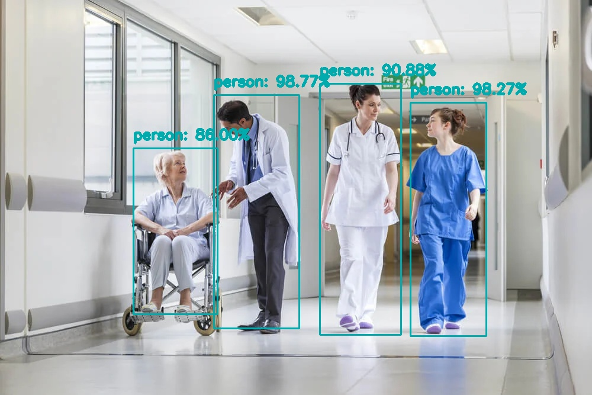
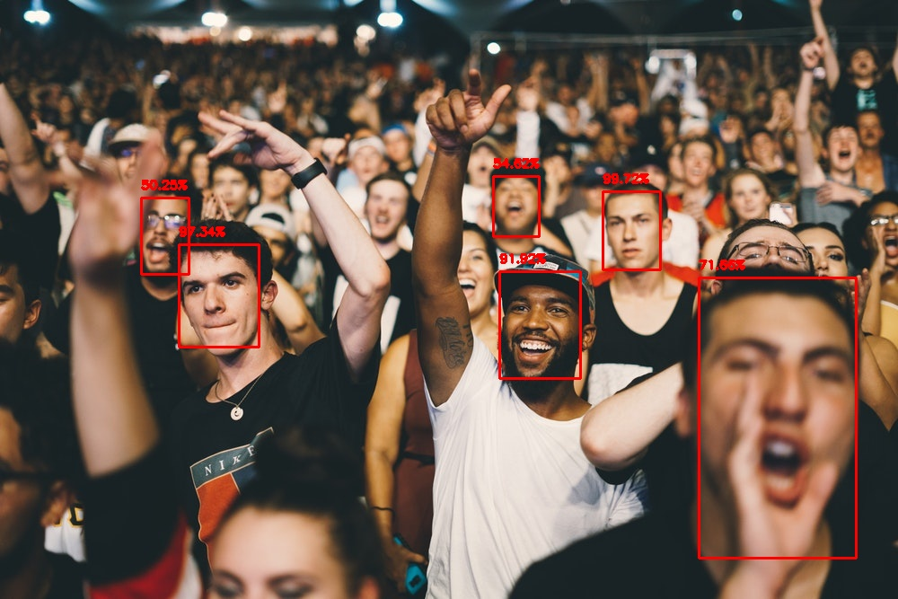

## 1. Goal of the Week4:

*  To choose a deep learning model for face detection, we have plethora of choices. These range from the R-CNN family to various YOLO versions, and options like SSD combined with OpenCV's DNN module. Additionally, these models can be built upon diverse base architectures, including VGG, MobileNet, and ResNet, among others.

## 2. Object Detection - Deep Learning (OpenCV)

Object detection in deep learning is predominantly centered around three main methodologies:

### 2.1. TWO Stage Detection Framework:

   #### 2.1.1. Region-based CNNs:
   - **R-CNN**:
      - Processes images containing multiple objects.
      - Overcomes the slidin g window approach by using the Selective Search algorithm, extracting approximately 2,000 region proposals.
         - Selection criteria: Similar pixel values/color, textures, lighting, size, shape and more.
         - As Iterations increase, it chooses ROI.
      - Passes these regions into a CNN to derive features (Each region is passed).
      - Warps region and passes through SVMs to classify these regions.
      - Notable limitations: Managing thousands of boxes and the need to resize images due to a fixed input size - loses image original features and takes long time to train, Selective Search algo is fixed - not a learning algo.
   - **Fast R-CNN**:
     - Passes the whole image through a CNN (like VGG or AlexNet) as opposed to individual regions.
     - Generates a feature map from the image. (Sends only once entire image to get features)
     - These features are then channeled through Spatial Pyramid Pooling (or ROI Pooling).
     - Ultimately, fully connected layers classify these regions via SVMs and also apply bounding box regressors.
     - Notable Limitation: Region Proposal Algorithm is not specifically trained/tuned for object detection task.
   - **Faster R-CNN**:
     - Addresses the random region selection encountered in previous models.
     - Substitutes the Selective Search with a Region Proposal Network (RPN) for efficiency.
     - RPN's roles: Objectness classification and bounding box regression.
     - General flow: Input Image → Convolutional Layer (to extract features) → Feature Maps → RPN → ROI Pooling → Classification (alongside bounding box regression).

   #### Sumamry I Understood:
   -  A 2 stage detection framework.
   -  First stage is for proposing "potential object regions" using methods such as Selective Search or Region Proposal Network. 
   -  Second Stage, classifier processes the candidate regions. 
   -  Accuracy is Ok, but model runs slowly. 

### 2.2. ONE Stage Detection Frameworks:

#### 2.2.1 You Only Look Once (YOLO):
   - A system devised for real-time object detection.
   - In R-CNN's we have 2 steps mainly : 
      - Some kind of algorithm to propose regions 
      - Classifier is used to see whether object is there actually in that region, if yes what kind of object is it?
      - So we will look twice into the image, YOLO resolves this.
   - **How Does it Work?**:
      - For every picture/frame it generates a vector of [Pc, Bx, By, Bw, Bh, C1, C2]. Pc = 1 if some object is there, 0 otherwise. Bx, By are center of box/anchor point. Bw, Bh are height and width of the bounding box. C1, C2 are are classes -> 1/0 based on class like Human Class1, Dog Class 2... etc. 
      - So X_train will be images with bounding boxes and Y_train will be vector of 7 Values. so a 10k or more of these samples will be trained using CNN. So when new image is given, it outputs a (7,) vector.
      - It is for single object, what about multiple objects? So the new algo is :
      - The image is divided into 4x4 or 8x8 or 18x18 ... anysize into grids. Then we will generate a vector of (7,) for each grid. then for example for 4x4 grid => output is 4x4x7. 
      - In one forward pass, we will get result. Because we are not doing 16 iterations (like 16 grid boxes), thats why it is YOLO. 
      - Intersection Over Union = intersect area/union area. (Higher the overlapping, higher the value >0.65 .. 1) this technique is known as Non-Max Supression.
   - **Limitations:** Sacrifices Localization Accuracy for speed - So bounding boxes doesnt fit objects properly; Due to fixed number of anchors in output - limited amount of objects can be detected in each grid set. Multiple YOLO versions tries to resolve some issues for versions less than 4. But we will try version8 YOLO V8 the latest version.
   
   **2.2.1.1 Hands On YOLO:**
   - YOLO V4 - Pre-trained weights, COCO Dataset is utilised for Object Detection. 
   <p align="center" width="80%">
    
    
   </p>

   - *(Code is available/uploaded to week4/YOLO_V4_ObjectDetection folder.)*

#### 2.2.2 Single Shot Detectors (SSDs) - OPENCV and SSD for Object Detection:
   - Introduced by Liu et al. in 2015.
   - Aims to detect objects in a single shot.
   - R-CNN's family are slow, on the order of 7FPS.
   - YOLO works faster, capable of processing 40-90 FPS and latest variant upto 155FPS, But the model produces less accuracte results.
   - Base Model: MobileNet - A 3×3 depthwise convolution and Followed by a 1×1 pointwise convolution. Trained on COCO data, Fine-tuned on PASCAL VOC.
   <p align="center" width="80%">
    <br/>
    <br/>
    <br/>
    <text>Fig: SSD Architecture</text><br/><br/>
    
   </p>

   #### Hands on - MobileNet SSD with OpenCV DNN

   ```python
   # Loading predfined Caffe Model's Architecture with predefined weights
   net = cv2.dnn.readNetFromCaffe(args["prototxt"], args["model"])

   # loading input image and constructing an input blob by resizing and then normalizing image.
   image = cv2.imread(args["image"])
   (h, w) = image.shape[:2]
   blob = cv2.dnn.blobFromImage(cv2.resize(image, (300, 300)), 0.007843, (300, 300), 127.5)

   # Passing the blob through the network and obtaining detections and predictions.
   net.setInput(blob)
   detections = net.forward()
   ```

   *  **Results:**
   <p align="center" width="80%">
    <br/>
    <br/>
    <br/>
    <text>Fig: SSD_MobileNet Object Detection Results</text><br/><br/>
   </p>

## 3. Face Detection - One Stage Detection Frameworks:

   ### 3.1 OpenCV SSD with ResNet10 Base Network:
   *  In-Place of MobileNet, proposed architecture used ResNet-10 architecture.

   ```python
   # loading model and weights
   net = cv2.dnn.readNetFromCaffe(args["prototxt"], args["model"])

   # Constructing an input blob for the loaded image by resizing to a fixed 300x300 pixels and then normalizing it
   image = cv2.imread(args["image"])
   (h, w) = image.shape[:2]
   blob = cv2.dnn.blobFromImage(cv2.resize(image, (300, 300)), 1.0, (300, 300), (104.0, 177.0, 123.0))

   # passing blob through the network and obtaining the detections and predictions
   net.setInput(blob)
   detections = net.forward()
   ```
   **Face Detection in Images & their Results:**
   <p align="center" width="80%">
    
    <br/>
    
    <br/>
    
    <br/>
    
    <br/>
   </p>

   **Face Detection in Realtime & their Results:**

   <figure class="video_container" align="center">
   <video controls="true" allowfullscreen="true" width="40%" poster="ResNetSSD_FaceDetection/Realtime_Tests/FaceDetection_T1.png">
      <source src="ResNetSSD_FaceDetection/Realtime_Tests/FaceDetection_Test1.mov" type="video/mp4">
   </video>
   <video controls="true" allowfullscreen="true" width="40%" poster="ResNetSSD_FaceDetection/Realtime_Tests/FaceDetection_T2.png">
      <source src="ResNetSSD_FaceDetection/Realtime_Tests/FaceDetection_Test2.mov" type="video/mp4">
   </video><br/>
   <text>Fig: SSD_ResNet Real-time Face Detection Results</text><br/> 
   <text>If video doesnt get running, download from here "WatchDog-Gamma/A1869202_Revanth/Week4_UPD/ResNetSSD_FaceDetection/Realtime_Tests/"</text>
   </figure>

   ### 3.2 YOLO V8:

   * Utilising YOLO V8 for Face Detection task. Because we can see the SSD ResNet hasnt performed well. It couldnt find so many faces. For training task, or to finalise the placement of camera
   we need the results of face detection on images from side, front etc.

   ```
   yolo task=detect mode=predict model=yolov8n-face.pt conf=0.25 imgsz=1280 line_width=1 max_det=1000 source=examples
   ```
   <br/>

   **Face Detection in Images & their Results:**
   <p align="center" width="80%">
    
    <br/>
    
    <br/>
    
    <br/>
    
    <br/>
    <text>Fig: YOLO V8 Face Detection Results</text><br/><br/>
   </p>
