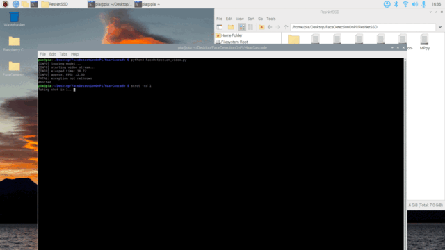

## Week 5 Updates: Deep Dive into Face Detection on Pi

### Goals:
- Select an efficient deep learning model for face detection on Raspberry Pi ensuring optimal FPS.

### Progress & Outcomes:

#### **`Experimenting with ResNet SSD`**:
- Started with the 2nd best model, anticipating the Pi might not efficiently handle YOLO V8.
- Implemented ResNet-10 Single Shot Detection, which initially returned a disappointing 0.4 - 0.8 FPS.
- After reading articles suggesting Optimal FPS rate for ResNet on Pi4, I have introduced a delay of 0.077 in the code, aiming for around 12.95 FPS.
- However, testing revealed an actual average FPS of only "0.5" due to the ResNet's extensive architecture, mistakenly thought I got 12 FPS becuase I gave 0.07 delay! 
- Then, Improved performance through multiprocessing and enhancing the Pi's clock frequency to 1200 Mhz gave approx 2 FPS. 
- Further efforts using multi-threading improved it slightly to 2.51 FPS - changed from OpenCV face reader to IMutils for Multi-threading inbuilt and converted all the code into multi-threading.

    ```python
        print("[INFO] starting video stream...")
        vs = VideoStream(src=0).start()

        blobQueue = queue.Queue(maxsize=10)
        detectionQueue = queue.Queue(maxsize=10)

        thread1 = threading.Thread(target=captureResizeBlob, args=(vs, blobQueue))
        thread2 = threading.Thread(target=applyModel, args=(net, blobQueue, detectionQueue))
        thread3 = threading.Thread(target=processAndDisplay, args=(detectionQueue, args, vs))

        thread1.start()
        thread2.start()
        thread3.start()
    ```

    <p align="center" width="80%">
        <br/>
        <text>Fig: FPS Testing why to change from CV.read() to IMUTILS.read() - Multithreading</text>
    </p>

- A true multiprocessing approach was attempted, but it caused the Pi to freeze without yielding better results.

    ```python
        blob_queue = Queue()
        detection_queue = Queue()
        exit_signal = Value('b', False)

        process1 = Process(target=capture_and_resize, args=(blob_queue, exit_signal))
        process2 = Process(target=apply_model, args=(blob_queue, detection_queue, exit_signal))
        process3 = Process(target=detect_and_show, args=(detection_queue, exit_signal, args))

        process1.start()
        process2.start()
        process3.start()
    ```

**Final Outputs from Initial Best to Multi-threaded Best results:**

<p align="center" width="80%">
    <br/>
    [ResnetSSD Real Time Face Detection on Pi](https://www.youtube.com/embed/d-iRHN53Vrs)
    <br/><text>Fig: Final Outputs</text>
</p>

#### **`Diving into Ultra-Light-Fast-Generic-Face-Detector-1MB - MNN`**:
- A lightweight face detection model designed for edge computing devices.
- Expected a higher FPS on Pi3 due to the architecture's promising features on Pi4.
- Tested both RFB and SLIM versions but achieved a similar FPS to ResNet (~1.51 FPS).

**Outputs:**

<p align="center" width="80%">
    
</p>

#### **`Exploring Haar Cascade`**:
- Achieved a decent FPS range of 12-14.
- Limitations included accurate face detection only when directly facing the camera.

**Outputs:**

<p align="center" width="80%">
    
</p>

#### **`Settling with Google's BlazeFace`**:
- An SSD architecture designed for mobile GPUs.
- Showed promising results with accurate face detections and a consistent 18-20 FPS.

    **Overview of final Model Used**:
    1. **Model Name**: BlazeFace
    2. **Purpose**: The Model is designed for detecting faces within images captured by smartphone cameras or webcams, mainly targeting front-facing camera images.
    3. **Model Size & Performance**: Model is lightweight at 224KB and runs at approximately 275FPS on a Pixel 2 single-core CPU.
    4. **Architecture**:
    - Type: Convolutional Neural Network (CNN).
    - Specifics: SSD-like with a custom encoder.
    - Input: RGB image (live video) resized to 128x128 pixels.
    - Output: Tensor of predicted embeddings representing anchors transformation used in Non Maximum Suppression algorithm.
    5. **Key Outputs**: For each detected face, the model returned facial bounding box coordinates, 6 facial keypoint coordinates, and a detection confidence score.

**Outputs:**

<p align="center" width="80%">
    <br/>
    [BlazeFace on CPU Realtime face detection](https://www.youtube.com/embed/RMyvvDmjF5I)<br/>
    [BlazeFace on Pi Realtime face detection without transmission](https://www.youtube.com/embed/tp5kEisfmYo)<br/>
    [BlazeFace Final Real Time Face Detection](https://www.youtube.com/embed/77tuGNTL2yY)<br/>
    <text>Fig: Face Detection Real-time with Multiple people with BlazeFace</text>
</p>

---

### `Final Decisions & Implementation`:

**Face Detection on Raspberry Pi**:
- Opting for Google's Mediapipe's "Blaze Face" due to its decent performance in both accuracy and FPS of 18-20.
- Face embedding generation reduced the FPS to 10-13, but these values are satisfactory considering the tests over a 3-meter distance (1.8 Seconds approx, tested manually by me).

**Face Embeddings Model**:
- Currently using "OpenFace", but might transition to "Face_recognition_dnn_opencv" if FPS drops significantly when data is sent in real-time with MQTT Protocol to backend.
- Pi's storage constraints has stopped me to not to update at this moment - Found when trying to get face embeddings using face recognition, so did with OpenFace to get face embeddings which still has 10-13 FPS. But this model will be updated with Face_Recognition_DNN to get face_embeddings.

### Challenges Faced, resolved, will be resolving:
- Storage limitations on the Pi - need to remove all other architectures and only keep required libraries for BlazeFace - will be resolved next week.
- Model constraints like angle limitations with Haar Cascade, though FPS is good, finding best model which detects faces with good accuracy and FPS as well - Resolved.

### Data and Security:
- Sending 128 Face Embedding Values to the server, ensuring security against potential hacking attempts.

### Face Recognition on Server/Laptop (Server-Side Developments):
- Utilizing the same face detection mechanism, currently with "BlazeFace".
- Utilized and worked with both architectures of "face_recognition_dnn - OpenCV" and "OpenFace" to get "Face Embeddings".
- Plans to switch to "Face_recognition_dnn_opencv" to possibly improve FPS - because we need to transmit as well or may be need to find a better Face Embedding retriver model from faces detected (If Data sent with MQTT reduces FPS, then I will research other methods to reduce Face EMbedding generation time).

### Upcoming Steps:
- Finalizing the best face recognition, possibly with Face_recognition_DNN from OpenCV or an SVM classifier.
- Investigating MQTT for efficient real-time data transfer from Pi to server.
