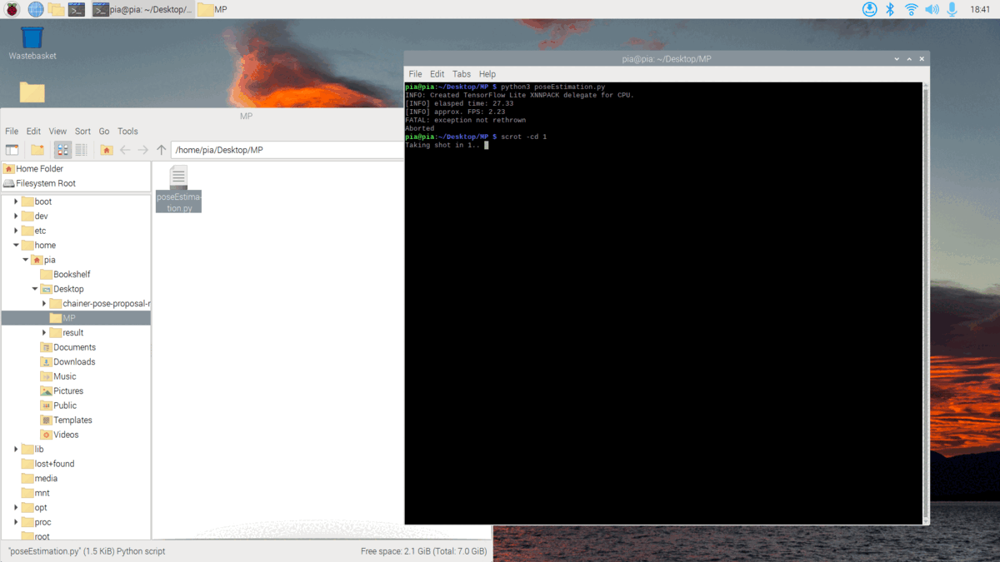
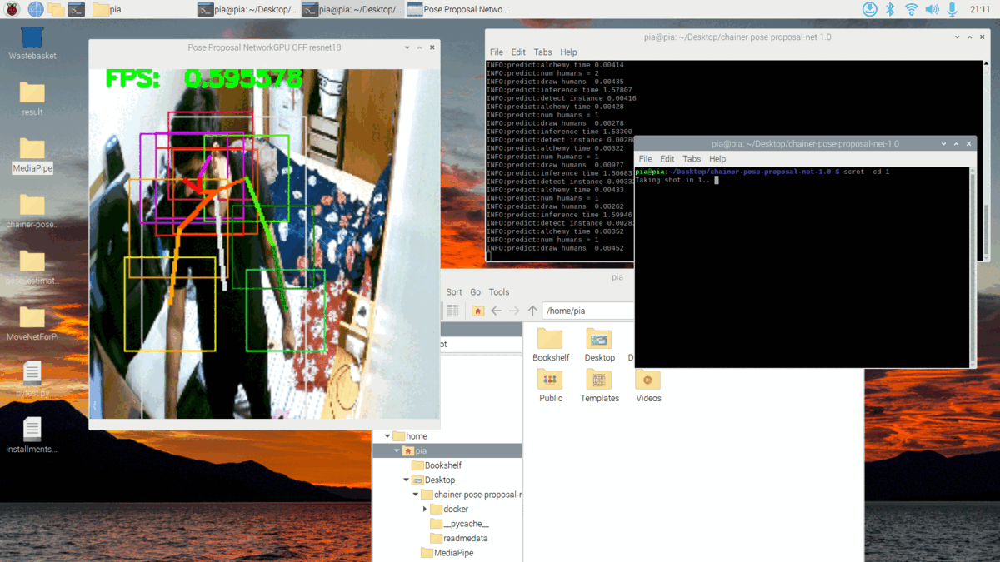
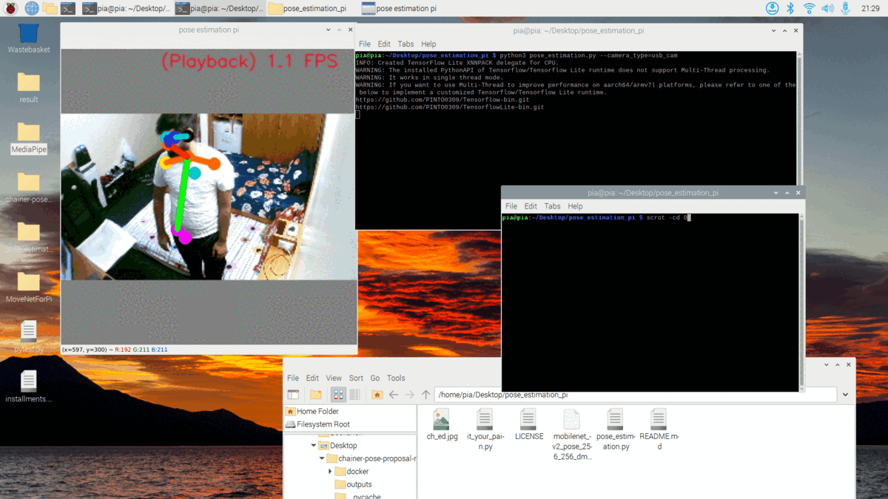
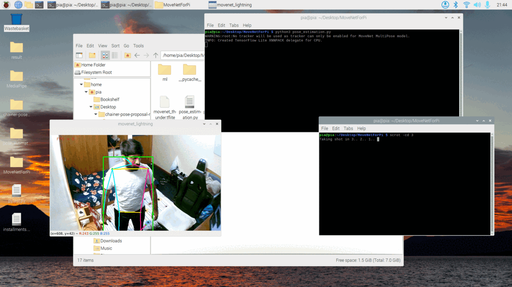
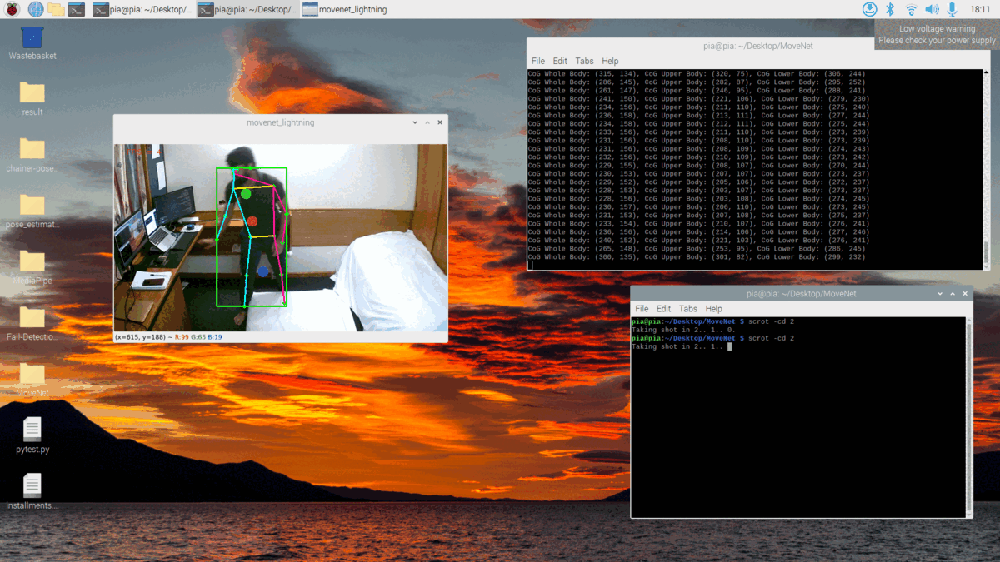

## Week 6 Updates: Deep Dive into Fall Detection on Pi

### Goals:
- Selecting an efficient model for fall detection on Raspberry Pi ensuring optimal FPS. The goal is to use the strengths of ML models to create a system that can detect falls. This system will not only be accurate but also work quickly in different real-life situations.

### Progress & Outcomes:

#### **`Why Not Traditional Methods for Fall Detection?`**
Traditional algorithms like Gaussian filters, though powerful in image processing, faltered in the domain of fall detection:

- **Noise Sensitivity**: Gaussian filter misinterpreted real-world noise (different objects in room), which has lead to lot of false detections. Model has Failed and detected even bottles, hands, face, beds as person, detected falls even with slight change in person movements.
- **Static Recognition**: They lack the ability to dynamically adjust to varied fall scenarios. Tried various falling ways, fell from different angles, detects sometimes and mostly makes lot of false detection, even shirt color has impacted removing backgrounds on gaussian filters.
- **Threshold Dependence**: Setting fixed thresholds (e.g., tilt angle) has lead to inconsistencies and gave even more false positives.

#### **`MediaPipe's BlazePose - MobileNetV2: A Leap Forward`**

**BlazeFace with MediaPipe:**  

* BlazeFace is a part of MediaPipe and is really good at detecting faces on edge devices like Pi3. Because BlazeFace has worked so well, I have expected BlazePose to be just as good, especially when used on edge devices like raspberry pi.

**What's Inside BlazePose:**  

* MediaPipe's BlazePose is designed to understand and identify body positions:
    - **Two-Part System**:
        1. **First Part**: Finds out if a person is in the picture and marks some key points.
        2. **Second Part**: Maps out 33 detailed points on the body in 3D.

- **How it Works**: BlazePose uses a design similar to MobileNetV2, made for real-time use. It also uses something called GHUM to get a detailed 3D picture of a person's body pose.

    ```python
    import mediapipe as mp
    ...
    mp_pose = mp.solutions.pose
    mpDraw = mp.solutions.drawing_utils
    pose = mp_pose.Pose()
    ...
    result = pose.process(rgb_frame)
    ...
    if result.pose_landmarks:
            mpDraw.draw_landmarks(frame, result.pose_landmarks, mp_pose.POSE_CONNECTIONS)
            for id, lm in enumerate(result.pose_landmarks.landmark):
                x = int(lm.x * 640)
                ....
    ```
- **Identifying Points**: This model had shown its proficiency in identifying various body parts, from facial features to major joints.

* However, there had been a significant drawback. Although BlazePose was capable of pinpointing body postures accurately, it lagged on my Raspberry Pi3, displaying only 1-4 images every second (FPS). This highlighted the challenges associated with optimizing intricate models for real-time applications on constrained devices.

    <p align="center" width="80%">
        <br/>
        <text>Fig: Pose Estimation Results with MediaPipe on Pi3</text>
    </p>

#### **`Chainer Pose Proposal - RESNET18`**

- Utilised a model designed on chainer framework, utilised chainercv (for computer vision activities), on ResNet architecture to detect poses.
- the model is detecting/estimating poses on Pi, but FPS is too low.
- utilised pretrained model (resnet18_224x224_coco).

    <p align="center" width="80%">
        <br/>
        <text>Fig: Pose Estimation Results with ReseNet18 - ChainerCV on Pi3</text>
    </p>

#### **`MobileNet V2 Pose Estimation`**
- Utilised MobileNet architecture to do pose estimation on Pi, but havent ended up in best FPS, just gave 1-2 FPS, but accuracy of pose detection is good.

    <p align="center" width="80%">
        <br/>
        <text>Fig: Pose Estimation Results with MobileNet V2 on Pi3</text>
    </p>

#### **`Pose Estimation and Fall Detection with MoveNet Single and Multipose`**

1. **MoveNet Overview**: The Google's Model, took from TensorFlow Lite, has given various models single/multipose (1 from this) + lightning/thunder (1 from this) is tried.

2. **Pose Estimation**: Pose estimation is about identifying the position of specific body parts from images or videos. MoveNet pinpoints 17 crucial keypoints, from nose to ankles.

3. **Choosing the Right Model**: MoveNet offers two distinct versions:
   - **MoveNet.Lightning**: It's nimble and swift but compromises a tad bit on accuracy. But not by much higher useful for edge devices.
   - **MoveNet.Thunder**: This one’s the heavyweight champion in terms of accuracy but it's larger in size and a bit slower. (gave almost 1 FPS on Multipose, 5 FPS approx for single pose)

   When I checked articles on MoveNet Vs its predecessors - PoseNet, OpenPose, MoveNet is found top in multiple benchmark tests did by google.

4. **Raspberry Pi Compatibility**: Given my interest in deploying on Raspberry Pi3, I was particularly intrigued by MoveNet's performance metrics on Raspberry Pi platforms. With a latency as low as 95ms for MoveNet.Lightning (INT8 quantized), it seemed a suitable candidate for real-time applications on such devices.

5. **Why MoveNet?** MoveNet's adaptability to different hardware setups, combined with its superior performance compared to previous models, made it my choice for pose estimation on Raspberry Pi3. In conclusion, MoveNet’s promise of accuracy, coupled with its efficiency on edge devices like Raspberry Pi3, seemed like a natural fit for my requirements. The journey was as much about understanding the nuances of the model as it was about leveraging its capabilities for practical use on edge devices.

    **Hands On MoveNet:**

    * Got Better pose estimation results on Pi upto 6 FPS on Pi with "TFLITE + MOVENET LIGHTENING".
    * Since the FPS is found satisfactory, I started working on fall detections, i tried fall detections in different ways:
        -  Initially tried with just calculating Falls based on height < Width if person falls. 
            -   We will get bounding boxes of person from movenet, when person is standing always height will be greater than width. (finding difference b/w (x1,y1) and (x2, y2) output coordinates from movenet).
            -   This has gave lot of false positives when hands are stretched while standing, so i have changed the fall detection method to Center of Gravity based.
            -   Now Center of Gravity (COG) for 3 main parts - 1. Lower Body COG, Upper Body COG, Whole Body COG. 
            -   Now once we calculate COG's, all we need to have a dry run to see how COG varies of body when standing and when falling, based on that I have changed the threshold values of distances of upto how far will be accepted

            ```python
            ...
            # Calculate CoG for the respective accumulators
            CoG_whole = calculate_CoG(total_x_whole, total_y_whole, count_whole)
            CoG_upper = calculate_CoG(total_x_upper, total_y_upper, count_upper)
            CoG_lower = calculate_CoG(total_x_lower, total_y_lower, count_lower)
            ...
            if (((CoG_whole[1] * image.shape[0])-(prev_CoGWhole_y)>82000) and ((CoG_upper[1] * image.shape[0])-(prev_CoGUpper_y)>80000)):
                # print("--------------- Fall Detected ---------------")
                cv2.putText(image, "Fall Detected", start_point, cv2.FONT_HERSHEY_PLAIN, 2, (144, 12, 63), 2)
            prev_CoGWhole_y = (CoG_whole[1] * image.shape[0])
            prev_CoGUpper_y = (CoG_upper[1] * image.shape[0])
            ...
            ```

    **Results:**
        <p align="center" width="80%">
            
            
            <br/>
            [Realtime Fall Detection 1 Video Link](https://youtu.be/xaM-bDdg-vk)<br/>
            [Realtime Fall Detection 2 Video Link](https://youtu.be/em5Om1luZMc)<br/>
            <text>Fig: Pose Estimation till Fall Detection Results with MoveNet on Pi3</text>
        </p>
        
